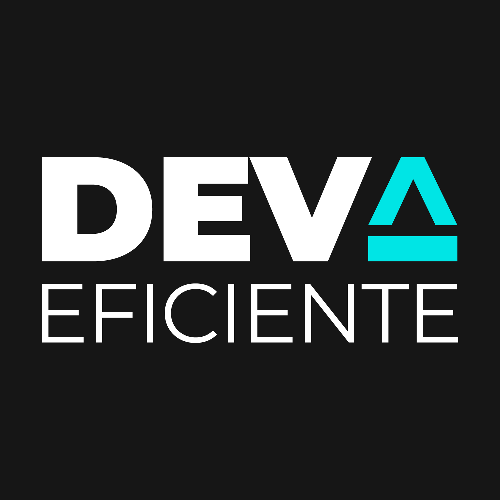

<h1 align="center">
    
</h1>

<h4 align="center"> 
	Jornada Dev Eficiente 🚀
</h4>


[](https://github.com/tacsio/jornada-dev-eficiente/issues)
[](https://github.com/tacsio/jornada-dev-eficiente/graphs/contributors)
[](https://github.com/tacsio/jornada-dev-eficiente/graphs/commit-activity)


## :soccer: Api Bolão 

Implementar a API necessária rodar uma aplicação que possibilite pessoas criarem bolões. No final do treinamento vamos ter passado por atividades que são supostamente mais simples, como cadastros, mas também vamos lidar situações um pouco mais complicadas, como criação de convites de participantes, associação de pessoas a grupos, palpites, validação de palpites etc.

### :pushpin: Stack

- [Java 14][java14] - JDK 14 is the open-source reference implementation of version 14 of the Java SE Platform as specified by by JSR 389 in the Java Community Process.
- [Spring Boot][spring] - Spring makes programming Java quicker, easier, and safer for everybody. Spring’s focus on speed, simplicity, and productivity has made it the world's most popular Java framework.
- [Spring Data JPA][springdata] - Spring Data JPA, part of the larger Spring Data family, makes it easy to easily implement JPA based repositories.
- [Spring Security][springsecurity] - Spring Security is a powerful and highly customizable authentication and access-control framework.
- [PostgreSQL][postgres] - PostgreSQL: The World's Most Advanced Open Source Relational Database
- [Lombok][lombok] - Project Lombok is a java library that automatically plugs into your editor and build tools, spicing up your java.


#### :heavy_dollar_sign: Run Scripts
```bash
./gradlew boot:run
```

## :books: API Casa do Código 

Desenvolver uma api para suportar parte do funcionamento da casa do código.

### :pushpin: Stack
- [Java 11][java11] - JDK 11 is the open-source reference implementation of version 11 of the Java SE Platform as specified by by JSR 384 in the Java Community Process.
- [Quarkus][quarkus] - A Kubernetes Native Java stack tailored for OpenJDK HotSpot and GraalVM, crafted from the best of breed Java libraries and standards.
- [H2 Database][h2] - The Java SQL database. Very fast, open source, JDBC API. Embedded and server modes; in-memory databases
- [OpenAPI][openapi] - The OpenAPI Specification: a broadly adopted industry standard for describing modern APIs.
- [Lombok][lombok] - Project Lombok is a java library that automatically plugs into your editor and build tools, spicing up your java.


#### :package: Extensions
1. RESTEasy JAX-RS
2. RESTEasy JSON-B
3. RESTEasy JSON-P
4. Hibernate Validator
5. SmallRye OpenAPI
6. Hibernate ORM with Panache
7. JDBC Driver - H2


#### :heavy_dollar_sign: Run Scripts
```bash
./mvnw quarkus:dev
```

## :bullettrain_side: Contributing

1. Fork it
2. Create your feature branch (`git checkout -b my-new-feature`)
3. Commit your changes (`git commit -am 'Added some feature'`)
4. Push to the branch (`git push origin my-new-feature`)
5. Create new Pull Request

[spring]: https://spring.io/
[java14]: https://openjdk.java.net/projects/jdk/14/
[springdata]: https://spring.io/projects/spring-data-jpa
[springsecurity]: https://spring.io/projects/spring-security
[postgres]: https://www.postgresql.org/
[lombok]: https://projectlombok.org/

[java11]: https://openjdk.java.net/projects/jdk/11/
[quarkus]: http://quarkus.io/
[h2]: http://www.h2database.com/html/main.html
[openapi]: https://www.openapis.org/


[rocketseat]: https://github.com/rocketseat
[nodejs]: https://nodejs.org
[reactjs]: https://reactjs.org/
[sqlite]:https://www.sqlite.org/index.html
[axios]: https://github.com/axios/axios
[expo]: https://expo.io/
[reactnative]: https://reactnative.dev/